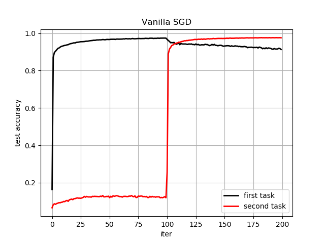
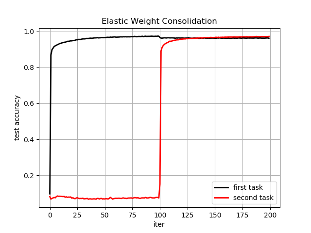

# Addressing the Stability-Plasticity Dilemma Through Elastic Weight Consolidation and Continual Learning Methods

This is an implementation of "Overcoming catastrophic forgetting in neural networks" (https://arxiv.org/abs/1612.00796) for supervised learning in TensorFlow.  Coursework for NEURO 140: Biological and Artificial Intelligence (Harvard University). Loosely inspired by Ari Seff's implementation for learning purposes.

### model.py: 
  Defines a simple fully-connected network and methods to compute the diagonal of the Fisher information matrix.

### experiment.ipynb:
  Trains and tests a single network on three MNIST classification tasks sequentially (i.e., once the network begins training on a given task, it is never exposed     to previous task training data again).

## Evaluation
Below a performance comparison between networks trained either with pure SGD or additionally with EWC, evaluated on two permuted mnist tasks. 

 
<!--     
 -->
